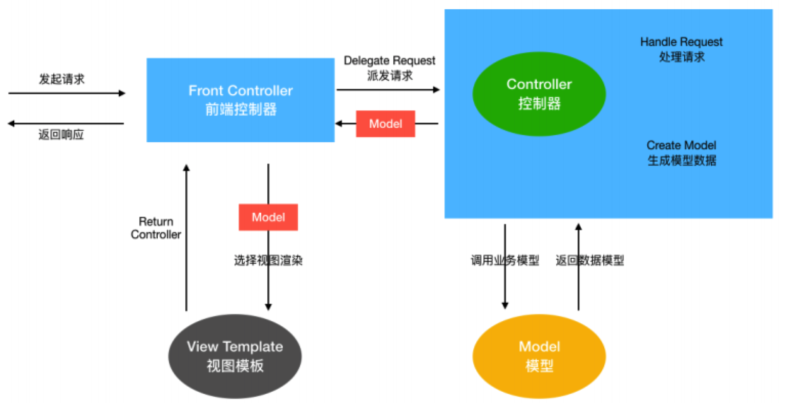
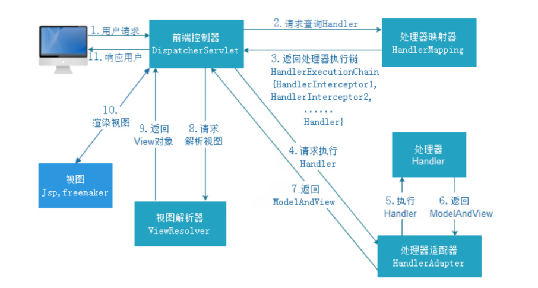

# spring-mvc-example
springmvc在web项目中基本上是必用的，基于servlet的一种控制层框架，介绍一下请求处理流程

## DispatcherServlet九大组件
- HandlerMapping（处理器映射器）
    - HandlerMapping是用来查找Handler的，也就是处理器，具体的表现形式可以是类，也可以是方法。比如，标注了@RequestMapping的每个方法都可以看成是一个Handler。Handler负责具体实际的请求处理，在请求到达后，HandlerMapping的作用便是找到请求相应的处理器Handler和Interceptor。
- HandlerAdapter（处理器适配器）
    - HandlerAdapter是⼀个适配器。因为Spring MVC中Handler可以是任意形式的，只要能处理请求即可。但是把请求交给Servlet的时候，由于Servlet的方法结构都是doService(HttpServletRequest req,HttpServletResponse resp)形式的，要让固定的Servlet处理方法调用Handler来进行处理，便是HandlerAdapter的职责。
- ViewResolver（视图解析器）
    - ViewResolver即视图解析器，用于将String类型的视图名和Locale解析为View类型的视图，只有一个resolveViewName()方法。从方法的定义可以看出，Controller层返回的String类型视图名viewName最终会在这里被解析成为View。View是用来渲染页面的，也就是说，它会将程序返回的参数和数据填入模板中，生成html文件。ViewResolver在这个过程主要完成两件事情：ViewResolver找到渲染所用的模板（第一件大事）和所用的技术（第二件大事，其实也就是找到视图的类型，如JSP ）并填入参数。默认情况下，Spring MVC会自动为我们配置一个InternalResourceViewResolver,是针对JSP类型视图的。
- HandlerExceptionResolver
    - HandlerExceptionResolver用于处理Handler产生的异常情况。它的作用是根据异常设置ModelAndView，之后交给渲染方法进行渲染，渲染方法会将ModelAndView渲染成页面。
- RequestToViewNameTranslator
    - RequestToViewNameTranslator组件的作用是从请求中获取ViewName.因为ViewResolver根据ViewName查找View，但有的Handler处理完成之后,没有设置View，也没有设置ViewName，便要通过这个组件从请求中查找ViewName。
- LocaleResolver
    - ViewResolver组件的resolveViewName方法需要两个参数，一个是视图名，一个是Locale。LocaleResolver用于从请求中解析出Locale，比如中国Locale是zh-CN，用来表示一个区域。这个组件也是i18n的基础。
- ThemeResolver
- MultipartResolver
    - MultipartResolver用于上传请求，通过将普通的请求包装成MultipartHttpServletRequest来实现。MultipartHttpServletRequest可以通过getFile()方法直接获得文件。如果上传多个文件，还可以调用getFileMap()方法得到Map<FileName，File>这样的结构，MultipartResolver的作用就是封装普通的请求，使其拥有文件上传的功能。
- FlashMapManager
    - FlashMap用于重定向时的参数传递，比如在处理用户订单时候，为了避免重复提交，可以处理完post请求之后重定向到一个get请求，这个get请求可以用来显示订单详情之类的信息。这样做虽然可以规避用户重新提交订单的问题，但是在这个页面上要显示订单的信息，这些数据从哪里来获得呢？因为重定向时么有传递参数这一功能的，如果不想把参数写进URL（不推荐），那么就可以通过FlashMap来传递。只需要在重定向之前将要传递的数据写入请求（可以通过ServletRequestAttributes.getRequest()方法获得）的属性OUTPUTFLASHMAP_ATTRIBUTE中，这样在重定向之后的Handler中Spring就会自动将其设置到Model中，在显示订单信息的页面上就可以直接从 Model 中获取数据。FlashMapManager就是用来管理FlashMap的。

注意：HandlerMapping、HandlerAdapter、ViewResolver为核心组件

九大组件都在 DispatcherServlet 类中
```
/** MultipartResolver used by this servlet. */
    // 多部件解析器
    @Nullable
    private MultipartResolver multipartResolver;

    /** LocaleResolver used by this servlet. */
    //地域解析器，国际化
    @Nullable
    private LocaleResolver localeResolver;

    /** ThemeResolver used by this servlet. */
    //主题解析器
    @Nullable
    private ThemeResolver themeResolver;

    /** List of HandlerMappings used by this servlet. */
    //处理器映射器组件
    @Nullable
    private List<HandlerMapping> handlerMappings;

    /** List of HandlerAdapters used by this servlet. */
    //处理器适配器组件
    @Nullable
    private List<HandlerAdapter> handlerAdapters;

    /** List of HandlerExceptionResolvers used by this servlet. */
    //处理器异常解析器
    @Nullable
    private List<HandlerExceptionResolver> handlerExceptionResolvers;

    /** RequestToViewNameTranslator used by this servlet. */
    //视图名称转换器
    @Nullable
    private RequestToViewNameTranslator viewNameTranslator;

    /** FlashMapManager used by this servlet. */
    //flash 组件管理器
    @Nullable
    private FlashMapManager flashMapManager;

    /** List of ViewResolvers used by this servlet. */
    //视图解析器
    @Nullable
    private List<ViewResolver> viewResolvers;
```

## MVC结构体系
三层架构：表现层、业务层和持久层

### MVC设计模式
MVC全名是Model View Controller，是模型(model)－视图(view)－控制器(controller) 的缩写， 是一种用于设计创建Web应用程序表现层的模式。

MVC中每个部分各司其职：
- Model（模型）：模型包含业务模型和数据模型，数据模型用于封装数据，业务模型用于处理业务。
- View（视图）： 通常指的就是我们的jsp或者html。作用一般就是展示数据的。通常视图是依据模型数据创建的。
- Controller（控制器）： 是应用程序中处理用户交互的部分。作用一般就是处理程序逻辑的。

MVC提倡：每一层只编写自己的东西，不编写任何其他的代码；分层是为了解耦，解耦是为了维护方便和分工协作



### spring MVC请求处理流程
所有请求都会通过 DispatcherServlet 来执行。



流程说明：
1. DispatcherServlet接收到客户端发送的请求
2. DispatcherServlet收到请求调用HandlerMapping处理器映射器
3. HandleMapping根据请求URL找到对应的handler以及处理器拦截器，返回给DispatcherServlet
4. DispatcherServlet根据handler调用HandlerAdapter处理器适配器
5. HandlerAdapter根据handler执行处理器，也就是我们controller层写的业务逻辑，并返回一个ModeAndView
6. HandlerAdapter返回ModeAndView给DispatcherServlet
7. DispatcherServlet调用ViewResolver视图解析器来解析ModeAndView
8. ViewResolve解析ModeAndView并返回真正的view给DispatcherServlet
9. DispatcherServlet将得到的视图进行渲染，填充到request域中
10. 返回给客户端响应结果


主要了解请求处理的流程，在DispatcherServlet中，先通过请求从handlerMappings中获取对应的handler,然后通过handler找到对应的handlerAdapter然后通过handlerAdapter的handle()方法真正执行controller层的业务逻辑。并返回一个ModeAndView然后通过ViewResolver解析成view并渲染到界面上。

当然这中间还有拦截器，主要在获取handlerAdapter后，会先执行拦截器方法，然后才执行真正的handler方法。